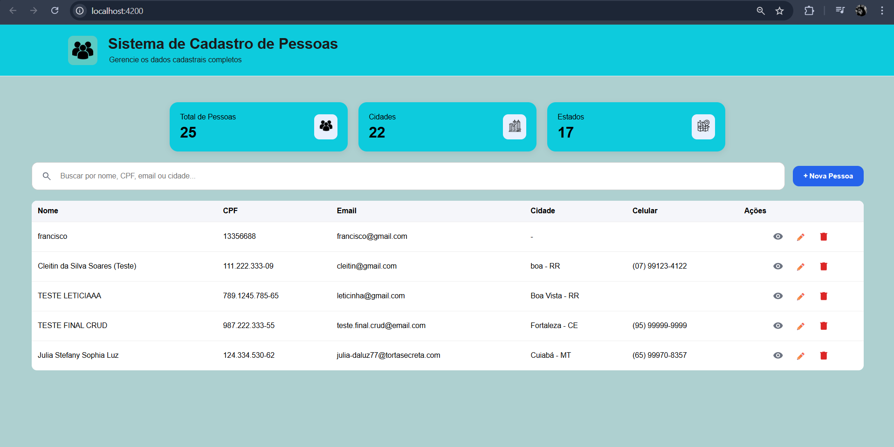
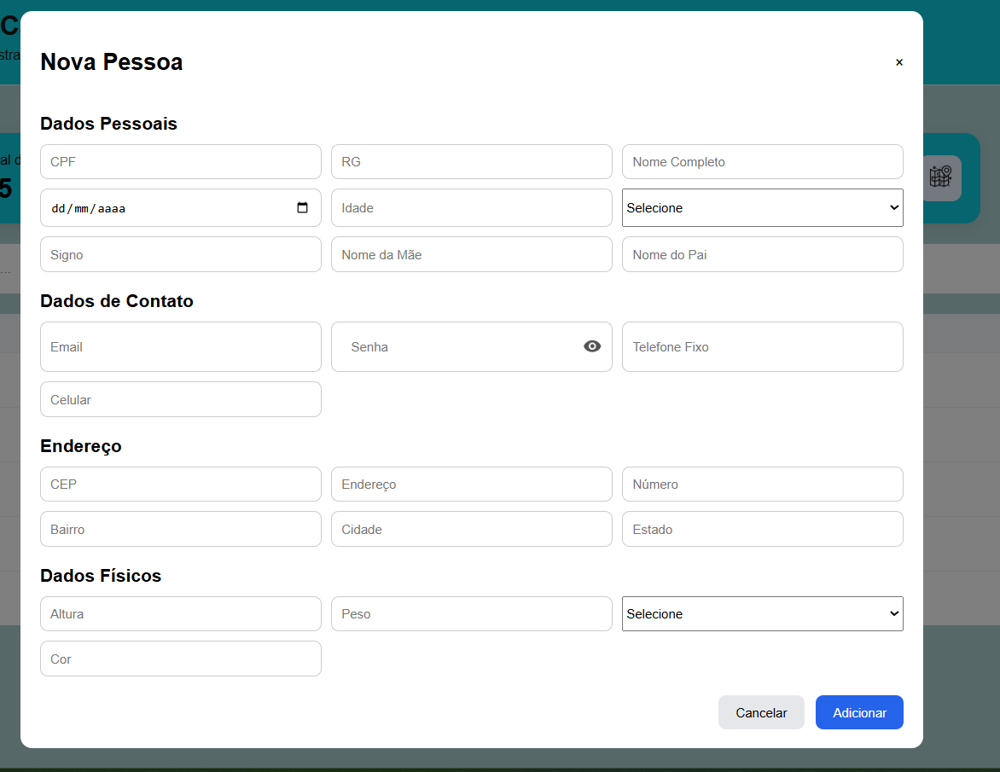
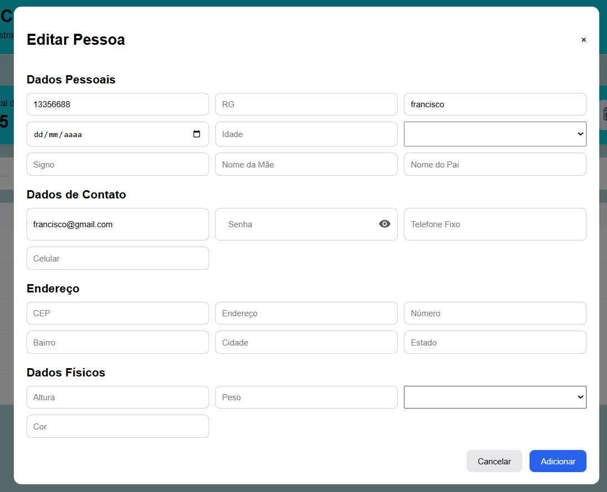
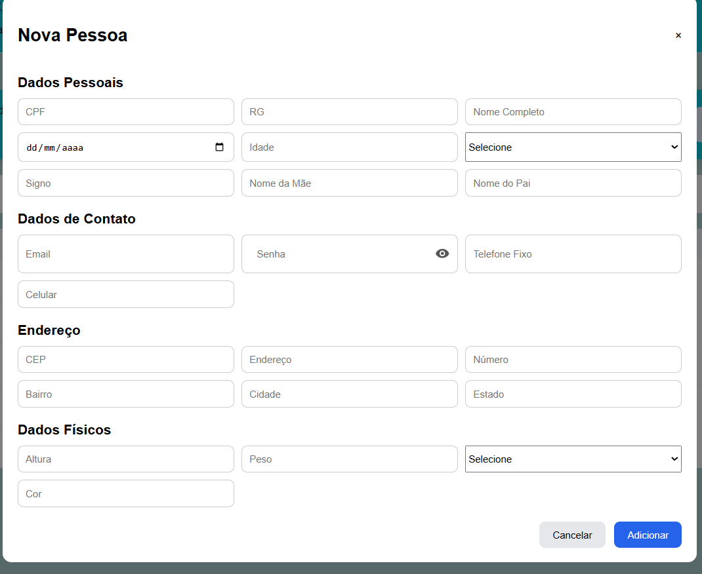
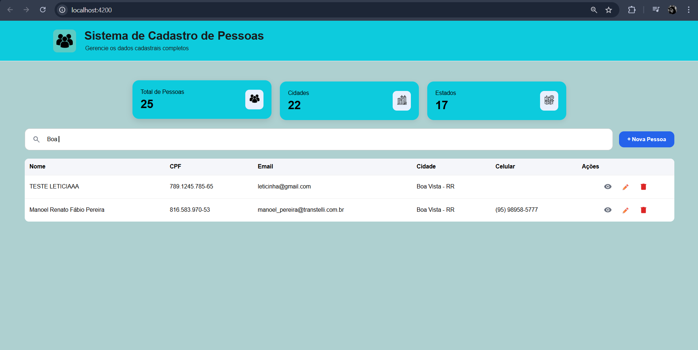

# Sistema de Cadastro de Pessoas

## Sobre o projeto

Este projeto é uma aplicação web desenvolvida em Angular para cadastro e consulta de pessoas.
O sistema consome uma API externa, exibe indicadores em cards, lista os registros cadastrados e oferece interações como busca, visualização de detalhes, cadastro e exclusão.

O foco da aplicação é entregar uma interface simples para gerenciamento de dados cadastrais, organizando as responsabilidades em componentes e páginas separados.

## Funcionalidades

- Exibição de resumo com total de pessoas, cidades e estados.
- Listagem de pessoas cadastradas.
- Busca por nome, CPF e email.
- Abertura de modal com detalhes da pessoa selecionada.
- Abertura de formulário para novo cadastro.
- Exclusão de registro com confirmação em modal.
- Feedback visual com notificações usando toast.

## Tecnologias utilizadas

- Angular 21
- TypeScript
- HTML
- CSS
- Angular Forms
- Angular HttpClient
- Angular Animations
- ngx-toastr
- Vitest

## Bibliotecas e recursos usados

### Angular

O projeto foi criado com Angular CLI e usa componentes standalone.

### HttpClient

Utilizado para comunicação com a API de pessoas.

### FormsModule

Usado para o binding dos campos do formulário e da busca.

### ngx-toastr

Responsável pelas notificações de sucesso e erro nas operações de cadastro e exclusão.

### provideAnimationsAsync

Necessário para o funcionamento das animações usadas pelo toastr.

## Estrutura do projeto

```text
src/
	app/
		app.config.ts
		app.css
		app.html
		app.routes.ts
		app.spec.ts
		app.ts
		components/
			cards/
				cards.css
				cards.html
				cards.spec.ts
				cards.ts
			header/
				header.css
				header.html
				header.spec.ts
				header.ts
		pages/
			formulario/
				formulario.css
				formulario.html
				formulario.spec.ts
				formulario.ts
			lista/
				lista.css
				lista.html
				lista.spec.ts
				lista.ts
```

## Organização por pasta

### `components`

Contém partes reutilizáveis da interface.

- `header`: cabeçalho principal da aplicação.
- `cards`: indicadores com totais carregados da API.

### `pages`

Contém as áreas principais da aplicação.

- `lista`: listagem, busca, detalhes e exclusão.
- `formulário`: cadastro de pessoa e reaproveitamento de dados para preenchimento.

### Arquivos principais da aplicação

- `app.ts`: componente raiz.
- `app.html`: estrutura principal da tela.
- `app.config.ts`: configuração global, providers, HttpClient e toastr.
- `app.routes.ts`: configuração de rotas. Atualmente está vazio.

## Como a aplicação funciona

### Header

Exibe o título do sistema e um texto de apoio no topo da página.

### Cards

Faz requisição para a API e calcula:

- total de pessoas
- total de cidades
- total de estados

### Lista

Faz a leitura da API e mostra os registros em tabela.
Também concentra as ações principais:

- busca por texto
- abertura do formulário
- visualização de detalhes
- confirmação de exclusão

### Formulário

Responsável pelo envio dos dados para cadastro de uma nova pessoa.
Também consegue receber uma pessoa selecionada para preencher os campos da tela.

## Integração com API

O projeto consome uma API Oracle ORDS no endpoint abaixo:

```text
https://gbebca2c3091cae-internshipdb1.adb.sa-saopaulo-1.oraclecloudapps.com/ords/estagio/pessoa/
```

### Operações usadas atualmente

- `GET`: carregar lista de pessoas.
- `POST`: cadastrar nova pessoa.
- `DELETE`: remover pessoa pelo CPF.

## Instalação e execução

### 1. Instalar dependências

```bash
npm install
```

### 2. Rodar o projeto em desenvolvimento

```bash
npm start
```

Depois disso, acesse:

```text
http://localhost:4200/
```

### Scripts disponíveis

### Iniciar servidor local

```bash
npm start
```

### Gerar build

```bash
npm run build
```

### Executar testes

```bash
npm test
```

### Build em modo watch

```bash
npm run watch
```

## Dependências do projeto

### Dependências principais

- `@angular/animations`
- `@angular/common`
- `@angular/compiler`
- `@angular/core`
- `@angular/forms`
- `@angular/platform-browser`
- `@angular/router`
- `ngx-toastr`
- `rxjs`
- `tslib`

### Dependências de desenvolvimento

- `@angular/build`
- `@angular/cli`
- `@angular/compiler-cli`
- `jsdom`
- `prettier`
- `typescript`
- `vitest`

## Observações

- O projeto utiliza componentes standalone.
- A aplicação depende da disponibilidade da API externa para carregar e enviar dados.
- O arquivo de rotas existe, mas a navegação por rotas ainda não está sendo usada.

## Referência visual

https://agile-tweak-98318116.figma.site/

## Imagens do projeto






